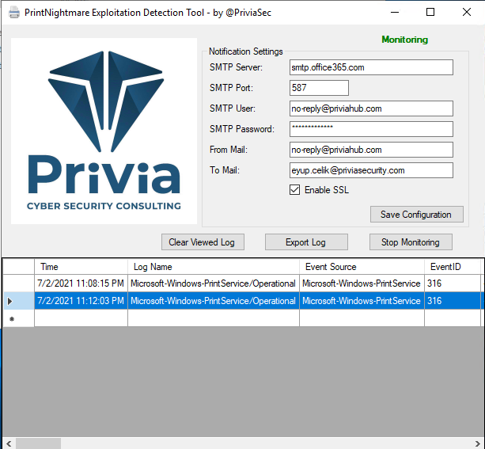

# PrintNightmare Detection Tool

After the exploit code of the PrintNightmare vulnerability was made public, our Cyber Security Team developed a detection tool for our customers. This tool allow us to detect of an attack in a possible attack attempt in systems where the use of printer services is mandatory.
